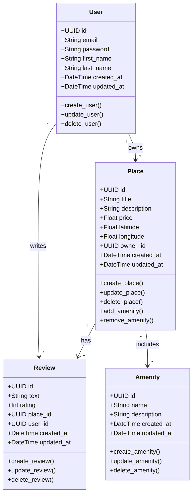

# Detailed Class Diagram for Business Logic Layer

## Class Diagram

## Entity Descriptions

### User
The User entity represents registered users in the system. Users can own places and write reviews.

**Key Attributes:**
- id: Unique identifier (UUID4)
- email: User's email address
- password: Encrypted password
- first_name, last_name: User's name
- created_at, updated_at: Timestamps

**Key Methods:**
- create_user(): Register a new user
- update_user(): Update user information
- delete_user(): Remove user from system

### Place
The Place entity represents properties available for booking.

**Key Attributes:**
- id: Unique identifier (UUID4)
- title, description: Place information
- price: Nightly rate
- latitude, longitude: Location coordinates
- owner_id: Reference to User who owns the place

**Key Methods:**
- create_place(): Add new place
- update_place(): Modify place details
- add_amenity(), remove_amenity(): Manage amenities

### Review
The Review entity represents user feedback on places.

**Key Attributes:**
- id: Unique identifier (UUID4)
- text: Review content
- rating: Numerical rating (1-5)
- place_id, user_id: References to Place and User

**Key Methods:**
- create_review(): Submit new review
- update_review(): Modify existing review
- delete_review(): Remove review

### Amenity
The Amenity entity represents features available at places (WiFi, Pool, etc.).

**Key Attributes:**
- id: Unique identifier (UUID4)
- name: Amenity name
- description: Amenity details

**Key Methods:**
- create_amenity(): Add new amenity type
- update_amenity(): Modify amenity details

## Relationships

1. **User to Place (One-to-Many)**: A user can own multiple places
2. **User to Review (One-to-Many)**: A user can write multiple reviews
3. **Place to Review (One-to-Many)**: A place can have multiple reviews
4. **Place to Amenity (Many-to-Many)**: Places can have multiple amenities, and amenities can belong to multiple places
